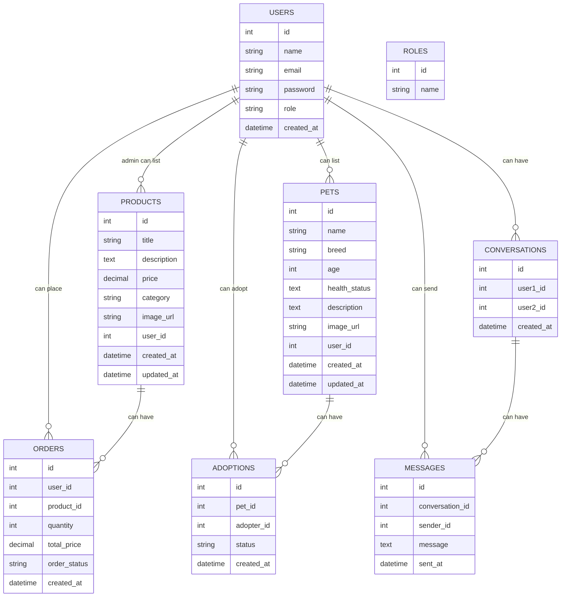

# Petgomania API

## Database Schema Overview

This document outlines the database schema for the Petgomania platform. The schema consists of the following key entities: **Users**, **Roles**, **Products**, **Pets**, **Orders**, **Adoptions**, **Messages**, and **Conversations**.

### Database Schema Diagram

